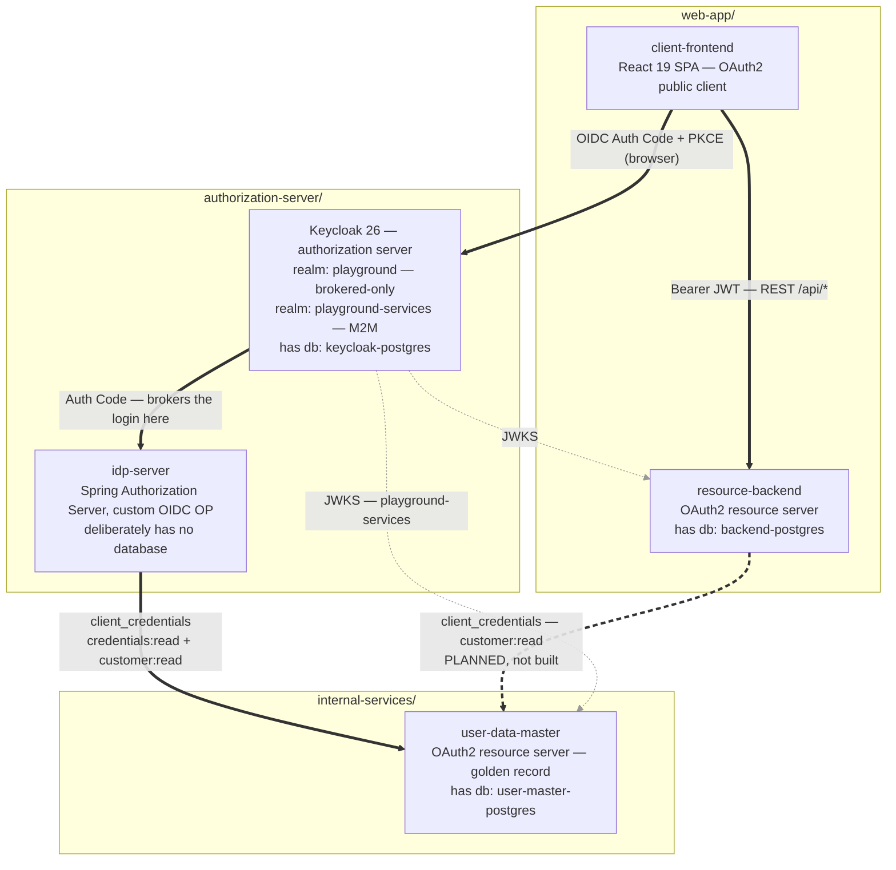

# AuthN + AuthZ Playground For Spring + KC Ecosystem

A self-contained playground for experimenting with OAuth2 / OpenID Connect end-to-end. **Keycloak** sits at the centre as the realm-level authorization server — it issues OIDC tokens to the SPA and carries authorization data (roles) inside those tokens — but it does no authentication of its own. **Authentication is delegated** to a custom upstream identity provider built on Spring Authorization Server (where username/password lives today and Smart-ID will plug in). A Spring Boot **resource server** validates the issued access tokens to gate its REST API.

This setup leverages the **identity brokering** pattern. New authentication methods land on the IdP without touching Keycloak's realm config or the resource server.

## What's in here

- **Keycloak** as the realm-level authorization server. Two realms: `playground` for customers (one public client `react-client`, one upstream identity-provider entry `playground-idp`, a `USER` realm role, brokered-only — Keycloak's own username/password login is disabled and the browser auto-redirects to the upstream IdP), and `playground-services` for machine-to-machine `client_credentials` traffic.
- **idp-server** — custom upstream identity provider built on Spring Authorization Server 7 (Java 25, Spring Boot 4). Owns the actual user authentication: username/password is live, Smart-ID is stubbed with placeholder fields. Federated to Keycloak as an OIDC provider. **Has no database** — it reads credentials from user-data-master on the fly, which is the classic user-federation pattern.
- **user-data-master** — Spring Boot 4 / Java 25 OAuth2 resource server holding the golden record: `users` (identity + person attributes) and `user_credentials` (password hashes, later Smart-ID bindings). Its `users.id` is the `sub` claim everything downstream keys on. Reachable only with a service token, and `credentials:read` is granted to exactly one client.
- **resource-backend** — Spring Boot 4 / Java 25 OAuth2 resource server. Validates JWTs against Keycloak's JWKS, exposes a small REST API, persists data via Flyway-managed PostgreSQL. It owns `custom_data` and app feature data only; person attributes belong to user-data-master, which it will read over HTTP once the *Inspect User Data* feature lands — making it an OAuth2 *client* as well as a resource server, the same dual role idp-server already has.
- **client-frontend** — React 19 / Vite 7 SPA acting as an OAuth2 public client. Uses Authorization Code + PKCE against Keycloak; talks to `keycloak-js` directly through a custom `AuthProvider` context.
- Three PostgreSQL instances — one each for Keycloak's own state, the user data master, and the resource-backend's app data.

## Architecture



**[docs/tech-overview.md](docs/tech-overview.md) owns this diagram** and is where it gets explained:
how to read the edge styles, why Keycloak sits in the middle, which edge is not built yet, the
step-by-step request/token flow, and the full tech stack. The copy above is for orientation — change
the one in `tech-overview.md` first.

## Folder structure

```
auth-playground/
├── docker-compose.yml                          # full-stack orchestration
├── authorization-server/
│   ├── keycloak/
│   │   └── realms/
│   │       ├── playground-realm.json           # customers; imported on Keycloak startup
│   │       └── playground-services-realm.json  # machine-to-machine clients
│   └── idp-server/                             # custom upstream IdP (Spring Authorization Server)
│       └── README.md
├── internal-services/
│   └── user-data-master-app/                   # golden record: users + credentials
│       └── README.md
├── web-app/
│   ├── client-frontend/                        # OAuth2 public client (React SPA)
│   │   └── README.md
│   └── resource-backend/                       # OAuth2 resource server (Spring Boot)
│       └── README.md
└── README.md
```

`authorization-server/keycloak/realms/` is mounted into the Keycloak container at `/opt/keycloak/data/import`; every JSON file in it gets imported on first boot. To add another realm, drop a JSON file alongside `playground-realm.json`.

`authorization-server/idp-server/` is a custom Spring-based OIDC OpenID Provider that handles user authentication. Keycloak brokers to it as an upstream IdP — it remains the authorization server issuing tokens to the SPA, but the actual login (username/password, later Smart-ID) happens on the IdP. See its [README](authorization-server/idp-server/README.md) for details.

`internal-services/` holds backend services that belong to neither the authorization tier nor the web app. Today that is `user-data-master-app`, which owns every user record and credential in the system; idp-server reads from it over HTTP and stores nothing itself. See its [README](internal-services/user-data-master-app/README.md).

## Quickstart for Local

Infrastructure (Keycloak + all three databases) always runs in Docker. The idp-server, user-data-master-app, resource-backend, and frontend can each run locally or containerized, independently. **idp-server and user-data-master-app are not yet dockerized** — run them locally via Gradle for now.

### Start the infra

```bash
docker compose up -d keycloak-postgres keycloak user-master-postgres backend-postgres
docker compose logs -f keycloak    # ready when it logs "Running the server in development mode"
```

### Run the apps outside Docker *(recommended for development)*

Hot-reload on all four apps. Backends use Spring DevTools, frontend uses Vite HMR.

Start `user-data-master-app` first: nobody can log in without it, since idp-server has no user store of its own.

```bash
# After starting the infra — in four separate terminals:
( cd internal-services/user-data-master-app && ./gradlew bootRun )
( cd authorization-server/idp-server && ./gradlew bootRun )
( cd web-app/resource-backend && ./gradlew bootRun )
( cd web-app/client-frontend && npm install && npm run dev )
```

### First-run

Smoke test: `curl http://localhost:8081/actuator/health` should return `{"status":"UP"}`. Sign in via the SPA → land on the IdP login page → enter `conan` / `conan123` → confirm registration → land on `/dashboard`. The Token Inspector (user menu → Token Inspector) shows the JWT (note the `identity_provider: playground-idp` claim) and the synced DB row side by side.

*The first time you sign in (as `conan` or `matrix`), Keycloak silently brokers to the upstream IdP, you authenticate there, Keycloak creates a shadow user, and the SPA lands on `/register`. At that point the resource-backend has no row for your Keycloak `sub`, so the SPA routes you through `POST /api/user/register` to confirm the imported claims. Every subsequent login fires `POST /api/user/sync` in the background so the row mirrors the latest JWT claims (name, email, username); the Token Inspector page shows the `lastSyncedAt` timestamp.*

For other run-mode combinations (fully containerized, mixed modes), ports, default credentials, and common compose commands, see [docs/local-setup-overview.md](docs/local-setup-overview.md).

---

## Subproject docs

For deeper details on each app — environment variables, security model, build/run commands, internal layout — see:

- [`authorization-server/idp-server/README.md`](authorization-server/idp-server/README.md)
- [`web-app/resource-backend/README.md`](web-app/resource-backend/README.md)
- [`web-app/client-frontend/README.md`](web-app/client-frontend/README.md)

For architecture, request/token flow, and the full tech stack, see [`docs/tech-overview.md`](docs/tech-overview.md). For ports, default credentials, and other local run modes, see [`docs/local-setup-overview.md`](docs/local-setup-overview.md).

Deferred work and known gaps are tracked in [`BACKLOG.md`](BACKLOG.md).
