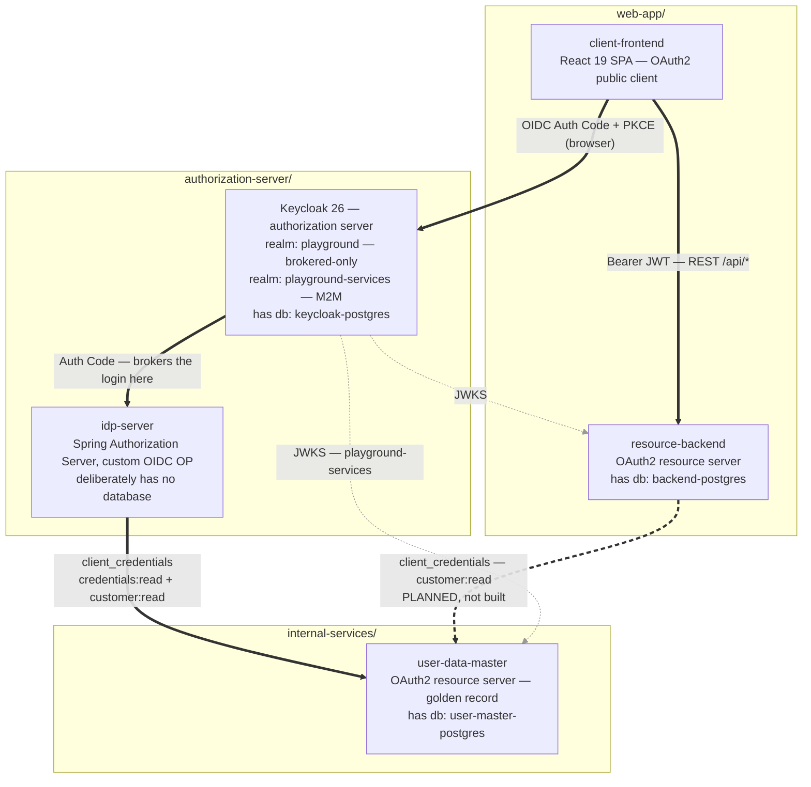

# Architecture & tech overview

> **This document owns the architecture diagram.** The [root README](../README.md) reproduces it for
> orientation and points here; anything about *how to read it* or *what is behind it* belongs in this
> file, so there is one place to change when the architecture does.

## Architecture

<b>Diagram legend</b> — edge styles, and the drawing conventions behind them

> *The system flows top to bottom, and each box is a **tier of the repo** — the subgraphs are literally
the top-level folders, so the picture and the directory listing are the same shape. That is not
decoration: the root [AGENTS.md](../AGENTS.md) states the repo is laid out *"by architectural tier,
not by deployable"*, and a new service is meant to land in the tier it belongs to. The diagram is
that rule, drawn.*
> *Edge weight carries meaning, so the OAuth2 story is not buried among its plumbing:*
>
> | Style | Meaning |
> |---|---|
> | **thick solid** | *the OIDC / OAuth2 flow — Authorization Code, PKCE, brokering, `client_credentials`* |
> | **thick dashed** | *same category, **specified but not built yet*** |
> | thin grey dotted | *supporting integrations — real dependencies, deliberately de-emphasised* |
>
> *The grey JWKS edges earn their place despite the de-emphasis, because they are the reason Keycloak
> sits in the middle: both resource servers verify token signatures against Keycloak's published
> keys, fetched and cached, **never per-request introspection**. Without them Keycloak is one box
> among five; with them it is the hub, which is what an authorization server should look like.*
>
> *The one thick dashed edge — `resource-backend → user-data-master` — is **specified but not
> implemented**. It arrives with the* Inspect User Data *feature in*
> [*http-logging_resource-backend-reference.md*](http-logging_resource-backend-reference.md#7-the-outgoing-half--the-inspect-user-data-feature)*.
> Its Keycloak service client already exists in* `playground-services-realm.json`*, unused, waiting
> for it.*
>
> ***Databases are named inside the service that owns them** rather than drawn as their own nodes.
> Three PostgreSQL instances, one per component, is deliberate — but the JDBC hop to your own
> database is not what this playground is about, and giving each one a box tripled the node count
> without adding a single idea.*

### Two things worth reading off it

- **Keycloak authenticates nobody.** It is the authorization server — it issues the tokens the SPA
  carries and owns the roles inside them — but the login itself is brokered upstream to `idp-server`.
- **`user-data-master` has two consumers, and they are not granted the same thing.** `idp-server`
  holds `credentials:read` (it needs password hashes to authenticate somebody) and is the only client
  in the whole services realm that does. `resource-backend` gets `customer:read` only — enough to
  read person attributes, never enough to see a credential. That asymmetry is realm configuration,
  not convention.

**Flow:**
1. Browser hits client-frontend → `keycloak-js` checks for an existing session; if none, redirects to Keycloak.
2. Keycloak's `playground` realm has local login disabled and a single upstream IdP configured (`playground-idp`). The browser is auto-redirected to **idp-server** at `/oauth2/authorize`.
3. The user submits credentials on idp-server's login page (username/password, eventually Smart-ID).
4. idp-server holds no user data, so it fetches the credential from **user-data-master** in a single call — presenting a `client_credentials` token it obtained from Keycloak's `playground-services` realm. The response carries the BCrypt hash *and* the person's attributes.
5. idp-server does the BCrypt comparison itself (the master is a store, not a verifier) and builds the authenticated principal with the master's `users.id` as its name — which is what makes `sub` a stable UUID. The person attributes ride along on that principal, so token issuance needs no second call to the master.
6. idp-server issues an OIDC token to Keycloak via Authorization Code (confidential client, server-to-server), carrying `sub`, profile/email claims, and `acr` / `amr` describing how the user authenticated.
7. Keycloak validates the upstream token, creates a shadow user on first login (via the trimmed-down "first broker login" flow) linked by federated identity to that `sub`, and issues its **own** tokens to the SPA via Authorization Code + PKCE.
8. SPA calls the resource-backend with `Authorization: Bearer <access_token>`.
9. resource-backend validates the JWT signature against Keycloak's JWKS endpoint and maps `realm_access.roles` to Spring Security authorities.
10. Protected endpoints query backend-postgres and return data scoped to the authenticated user.

The resource-backend doesn't know upstream brokering exists — it only sees Keycloak-issued JWTs. The Token Inspector page surfaces the JWT's `identity_provider` claim, which is how you can tell brokering happened.

**Two subject identifiers, and they are not the same.** idp-server's `sub` is the master's `users.id`; Keycloak mints its *own* `sub` for its shadow user and puts that in the SPA's tokens. The link between them is Keycloak's federated identity record, which stores the master's UUID. That is deliberate — each authorization server owns its own subject namespace — and it is why the master's UUID has to be stable: it is the join key for the whole federation.

## Tech stack

| Layer | Tech                                                                                                                     |
|---|--------------------------------------------------------------------------------------------------------------------------|
| Auth server | Keycloak 26.4 — realm `playground` (brokered-only, local login disabled) + realm `playground-services` (M2M)             |
| Upstream IdP | Java 25, Gradle 9.5 (Kotlin DSL), Spring Boot 4.0, Spring Security 7 with Spring Authorization Server, Thymeleaf. No datasource — reads from the user data master |
| User data master | Java 25, Gradle 9.5 (Kotlin DSL), Spring Boot 4.0, Spring Security 7 with OAuth2 Resource Server, Flyway                |
| Resource server | Java 25, Gradle 9.5 (Kotlin DSL), Spring Boot 4.0, Spring Security 7 with OAuth2 Resource Server, Flyway                 |
| Client | React 19, Vite 7, React Router 7, keycloak-js 26, Axios                                                                  |
| Databases | PostgreSQL 16 (×3 — one each for Keycloak, user-data-master, resource-backend)                                           |
| Orchestration | Docker Compose v2                                                                                                        |
